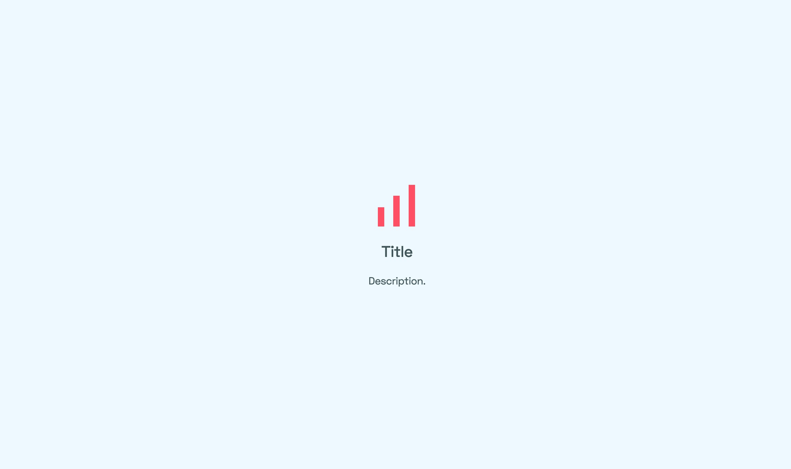
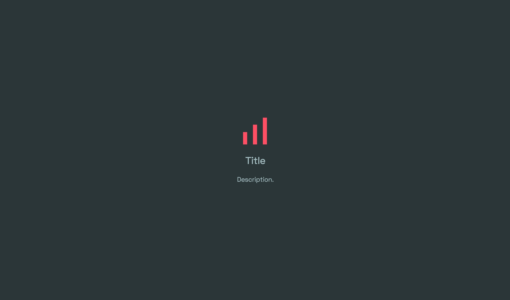
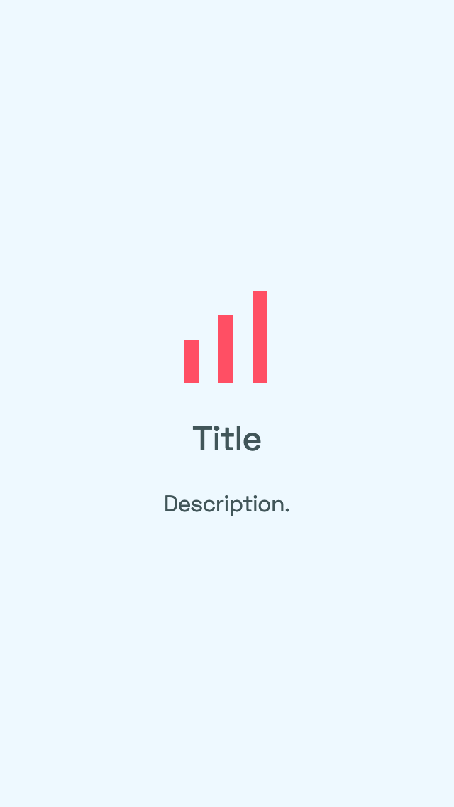
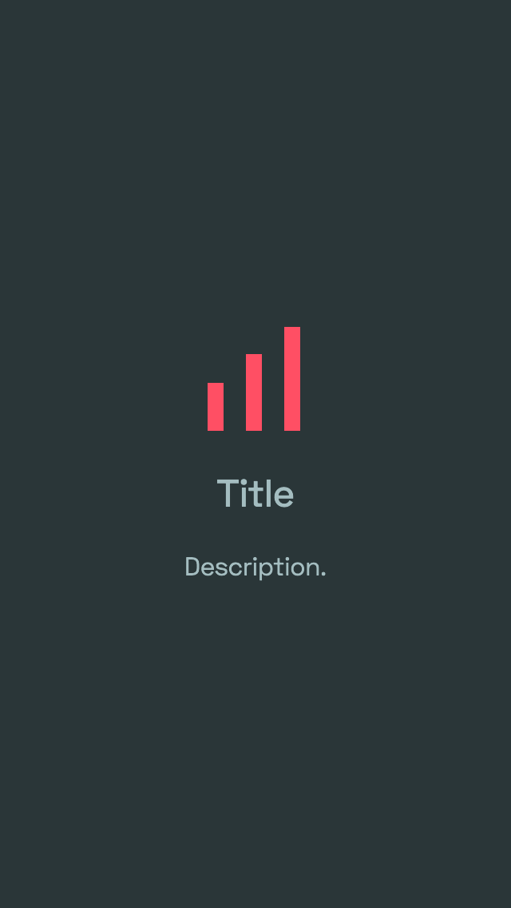

# Static page

A static page we can use for error pages or homepages of our CDN's.

[Live preview](https://simpleanalytics.github.io/static-page/).

## Desktop

<kbd></kbd>

<kbd></kbd>

## Mobile

<kbd></kbd> <kbd></kbd>
